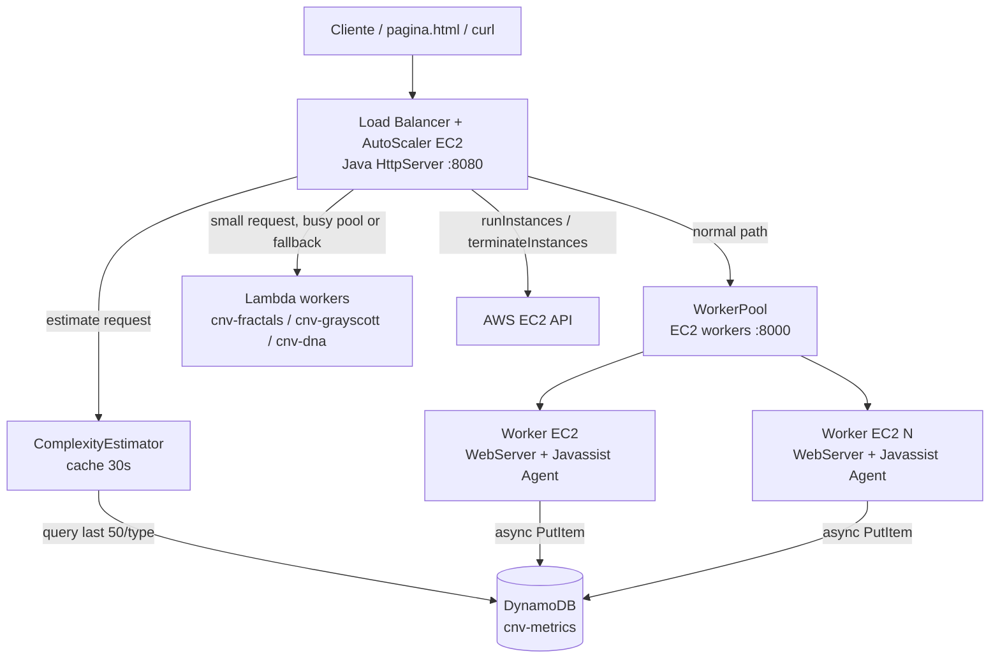

# Análise detalhada do estado atual do projeto Nature@Cloud

> **Projeto:** Nature@Cloud — CNV 2025/26, Grupo 35  
> **Data da análise:** 2026-06-05  
> **Objetivo deste documento:** consolidar, com detalhe técnico, o estado atual do projeto para servir de base ao relatório final.  
> **Validação local executada durante esta análise:** `mvn -q clean package -DskipTests` executado com sucesso; diagnósticos do editor sem erros/avisos.

---

## 0. Sumário executivo

O projeto encontra-se num estado **substancialmente completo para a entrega final**: há implementação funcional dos três workloads, workers EC2 instrumentados com Javassist, armazenamento de métricas em DynamoDB, Load Balancer e AutoScaler próprios, integração Lambda, scripts de deployment/cleanup, benchmarks e documentação de validação AWS.

A arquitetura implementada corresponde ao enunciado: um **Load Balancer em EC2** é o ponto único de entrada, encaminha pedidos para **workers EC2** ou **workers Lambda**, estima complexidade a partir de parâmetros + histórico no **DynamoDB**, e um **AutoScaler co-localizado com o LB** lança/termina workers EC2 conforme carga estimada.

### Estado consolidado por área

| Área | Estado atual | Observações |
|---|---|---|
| Workloads `/fractals`, `/grayscott`, `/dna` | Implementados e funcionais | HTTP, Lambda handler e CLI existem para todos; outputs são data URI PNG para Fractals/GrayScott e HTML para DNA. |
| Worker WebServer EC2 | Implementado | `HttpServer`, porta 8000, `CachedThreadPool`, contextos `/`, `/fractals`, `/grayscott`, `/dna`. |
| Javassist instrumentation | Implementado | ICount por basic block com `+N` instruções; `methodCallCount`; `allocatedBytes` via `ThreadMXBean`; `elapsedTimeMs`. |
| MSS DynamoDB | Implementado | Tabela `cnv-metrics`, partition key `requestType`, sort key `requestId`, escrita assíncrona. |
| ComplexityEstimator | Implementado | Histórico DynamoDB com cache 30s + heurísticas calibradas; métrica composta CPU+RAM. |
| Load Balancer | Implementado | Routing cost-aware, packing/spreading, retries, Lambda fast-path/fallback. |
| AutoScaler EC2 | Implementado | Descobre workers, lança workers, scale-up/down por segundos estimados, health eviction. |
| Lambda | Implementado | `cnv-fractals`, `cnv-grayscott`, `cnv-dna`; deploy idempotente via script. |
| AWS scripts | Implementados | IAM, network, AMI, worker, LB, Lambdas, cleanup. Pipeline documentada. |
| Benchmarks/calibração | Fortes | ICount, RAM, throughput t3.micro, scale-up/down, smoke tests AWS. |
| Testes automatizados formais | Fracos/inexistentes | Há scripts operacionais e benchmarks, mas não há unit tests. |
| Documentação | Muito rica, mas com partes stale | Existem documentos históricos com `basicBlockCount`, key paths e thresholds antigos. |
| Relatório/vídeo final | Ainda por fazer | `checkpoint-report.tex` contém placeholder de vídeo e “Remaining Work” parcialmente desatualizado. |

### Conclusão de alto nível

O trabalho mais importante para o relatório final é **harmonizar a narrativa**: a documentação contém várias fases históricas, algumas já ultrapassadas. A versão que deve ser apresentada como estado final é:

- métrica primária: `instructionCount` / ICount;
- métrica composta: `W_CPU × instructionCount + W_RAM × allocatedBytes`;
- estimator: histórico DynamoDB + cache 30s + fallback heurístico calibrado;
- LB: packing + spreading fallback, retry e Lambda como válvula para pedidos pequenos;
- AS: thresholds em segundos calibrados para t3.micro;
- MSS: DynamoDB com `instructionCount` e `allocatedBytes`;
- AWS: pipeline de scripts 01–06 + cleanup;
- validação: build local atual passou, e há evidência AWS documentada de smoke tests, scale-up/down, Lambda e cleanup.

---

## 1. Fontes analisadas

Foram analisados diretamente:

- `Project.txt` — enunciado e requisitos oficiais.
- `README.md`, `PROJECT_STATUS.md`, `changes-summary.md`.
- `report/checkpoint-report.tex`.
- Toda a pasta `docs/`, incluindo roadmap, fixes, calibração, deployment, cache, fault tolerance, stress tests e relatório AWS.
- Código-fonte Java dos módulos:
  - `webserver`
  - `javassist`
  - `loadbalancer`
  - `fractals`
  - `grayscott`
  - `dna`
- Scripts AWS e scripts de teste em `scripts/` e `scripts/test/`.
- Benchmarks em `benchmarks/` e `docs/evidence-2026-05-21-calibration/`.
- Frontend estático `pagina.html` e template `dna-result-template.html`.

---

## 2. Requisitos do enunciado e cumprimento atual

O enunciado em `Project.txt` pede um serviço cloud elástico na AWS para executar workloads parametrizados inspirados na Natureza:

| Workload | Endpoint | Parâmetros principais |
|---|---|---|
| Julia-set fractal generation | `/fractals` | `w`, `h`, `iterations` |
| Gray-Scott reaction-diffusion | `/grayscott` | `size`, `maxIterations`, `f`, `k`, `stopOnExtinction`, `seedMode` |
| DNA matching de FASTA sequences | `/dna` | `seq1`, `seq2`, `minLength`, `stopOnFirst` |

O sistema deve ter quatro componentes:

1. **Workers** — EC2 e Lambda.
2. **Load Balancer** — ponto único de entrada.
3. **AutoScaler** — ajusta número de workers EC2.
4. **Metrics Storage System** — DynamoDB para métricas.

### Matriz requisito → implementação

| Requisito do enunciado | Implementação atual | Estado |
|---|---|---|
| Workers VM EC2 multi-threaded | `webserver.WebServer` usa `HttpServer` + `Executors.newCachedThreadPool()` | Cumprido |
| Workers Lambda | Cada workload implementa `RequestHandler<Map<String,String>, String>`; script `06-deploy-lambdas.sh` cria 3 funções | Cumprido |
| Instrumentação Javassist nos VM workers | Java agent `JavassistAgent` usado no systemd da AMI worker | Cumprido |
| Métricas dinâmicas de complexidade | `instructionCount`, `methodCallCount`, `allocatedBytes`, `elapsedTimeMs` | Cumprido |
| MSS DynamoDB | `MetricsStorageService` cria/escreve tabela `cnv-metrics`; `ComplexityEstimator` lê histórico | Cumprido |
| LB próprio em VM EC2 | `LoadBalancer.java`, porta 8080, forwarding e decisões custom | Cumprido |
| AS próprio | `AutoScaler.java` co-localizado no LB, SDK EC2 real | Cumprido |
| Balanceamento por complexidade | `ComplexityEstimator` + `WorkerPool.selectForRequest()` | Cumprido |
| Balanceamento EC2 vs Lambda | Lambda para pedidos ≤5s quando workers >80% ou fallback após retries | Cumprido |
| Automação cloud e cleanup | Scripts 01–06 + 99 cleanup | Parcial/forte, mas multi-step; não há single-command final |
| Relatório final + vídeo | Ainda não produzidos | Pendente |

---

## 3. Arquitetura atual



### Componentes principais

| Componente | Código | Responsabilidade |
|---|---|---|
| Worker WebServer | `webserver/src/main/java/.../WebServer.java` | Servir endpoints dos workloads na porta 8000. |
| Root health endpoint | `webserver/.../RootHandler.java` | Health check simples em `/`, devolve HTTP 200 sem corpo. |
| Javassist Agent | `javassist/.../JavassistAgent.java` | Instrumentar classes dos workloads no load-time. |
| MetricRegistry | `javassist/.../MetricRegistry.java` | Métricas `ThreadLocal` por pedido e snapshots concluídos. |
| MetricsStorageService | `javassist/.../MetricsStorageService.java` | Persistência assíncrona em DynamoDB. |
| LoadBalancer | `loadbalancer/.../LoadBalancer.java` | Recebe pedidos, estima custo, decide EC2/Lambda, faz retries. |
| WorkerPool | `loadbalancer/.../WorkerPool.java` | Mantém workers, carga estimada, health checks, seleção. |
| AutoScaler | `loadbalancer/.../AutoScaler.java` | Escala EC2 workers via AWS SDK. |
| ComplexityEstimator | `loadbalancer/.../ComplexityEstimator.java` | Estima custo composto com histórico ou heurísticas. |
| LambdaInvoker | `loadbalancer/.../LambdaInvoker.java` | Invoca funções Lambda via AWS SDK. |
| AwsConfig | `loadbalancer/.../AwsConfig.java` | Centraliza system properties AWS. |

---

## 4. Estrutura do repositório

O projeto raiz é um reactor Maven com seis módulos:

```text
CNV/
├── pom.xml
├── Project.txt
├── README.md
├── PROJECT_STATUS.md
├── changes-summary.md
├── pagina.html
├── docs/
├── report/checkpoint-report.tex
├── scripts/
├── benchmarks/
├── javassist/
├── webserver/
├── fractals/
├── grayscott/
├── dna/
└── loadbalancer/
```

`CNV/pom.xml` declara:

```xml
<modules>
  <module>javassist</module>
  <module>webserver</module>
  <module>fractals</module>
  <module>dna</module>
  <module>grayscott</module>
  <module>loadbalancer</module>
</modules>
```

### Build e dependências principais

| Módulo | Artifact | Dependências principais |
|---|---|---|
| `fractals` | `fractals` | `aws-lambda-java-core`, `jackson-databind` |
| `grayscott` | `grayscott` | `aws-lambda-java-core` |
| `dna` | `dna` | `aws-lambda-java-core`, `jackson-databind` |
| `webserver` | `webserver` | depende de `fractals`, `dna`, `grayscott`, `javassist-agent` |
| `javassist` | `javassist-agent` | `javassist 3.30.2-GA`, `aws-java-sdk-dynamodb 1.12.528` |
| `loadbalancer` | `loadbalancer` | `aws-java-sdk-ec2`, `aws-java-sdk-dynamodb`, `aws-java-sdk-lambda` |

Todos usam Java 11 e geram `jar-with-dependencies` via `maven-assembly-plugin`.

Validação executada nesta análise:

```bash
mvn -q clean package -DskipTests
```

Resultado: comando executado com sucesso.

---

## 5. Workloads e endpoints

## 5.1 `/fractals` — Julia Set

### Código

- `fractals/src/main/java/pt/ulisboa/tecnico/cnv/fractals/FractalsHandler.java`
- `fractals/src/main/java/pt/ulisboa/tecnico/cnv/fractals/JuliaFractal.java`

### Interfaces suportadas

| Interface | Implementação |
|---|---|
| HTTP EC2 | `HttpHandler.handle(HttpExchange)` |
| Lambda | `RequestHandler<Map<String,String>, String>.handleRequest()` |
| CLI | `main(String[] args)` escreve PNG real para ficheiro |

### Parâmetros

| Parâmetro | Tipo | Default HTTP | Default Lambda | Significado |
|---|---:|---:|---:|---|
| `w` | int | 800 | 800 | largura |
| `h` | int | 600 | 600 | altura |
| `iterations` | int | 100 | 50 | limite de iterações |

Nota: há uma pequena divergência entre default HTTP (`iterations=100`) e Lambda (`iterations=50`).

### Output

O endpoint HTTP/Lambda devolve uma **string data URI**:

```text
data:image/png;base64,...
```

Não devolve bytes PNG crus. Assim, comandos que usam `curl --output fractal.png` gravam uma string base64 com prefixo, não um PNG diretamente. Para obter PNG real é preciso remover o prefixo e fazer base64 decode.

### Algoritmo

`JuliaFractal.generate(width, height, maxIterations)`:

- cria `BufferedImage(TYPE_INT_RGB)`;
- para cada pixel, mapeia coordenadas para o plano complexo;
- itera `z = z² + c` com constantes atuais:
  - `cRe = -0.4`
  - `cIm = 0.6`
  - `zoom = 1.0`
- continua enquanto `zx² + zy² < 4` e `i > 0`;
- usa tons de verde para pontos que escapam.

### Complexidade e calibração

Teoricamente: `O(w × h × iterations)`.  
Empiricamente, para esta Julia set, o custo **satura a `iterations≈500`**.

Feature final no estimator:

```text
w × h × min(iterations, 500)
```

Heurística CPU fallback:

| Regime | Multiplicador |
|---|---:|
| `iterations <= 100` | 10 |
| `100 < iterations <= 300` | 5 |
| `iterations > 300` | 2 |

Heurística RAM fallback:

```text
allocatedBytes ≈ w × h × 33
```

### Limitações

- Não valida dimensões máximas/minímas no servidor.
- `w <= 0`, `h <= 0` ou valores enormes podem gerar exceções ou `OutOfMemoryError`.
- `iterations < 0` não é explicitamente rejeitado.
- Não define `Content-Type`.
- `queryToMap()` usa `split("=")` sem limite; valores com `=` podem ser truncados.

---

## 5.2 `/grayscott` — Gray-Scott reaction-diffusion

### Código

- `grayscott/src/main/java/pt/ulisboa/tecnico/cnv/grayscott/GrayScottHandler.java`
- `grayscott/src/main/java/pt/ulisboa/tecnico/cnv/grayscott/GrayScott.java`

### Parâmetros

| Parâmetro | Tipo | Default | Significado |
|---|---:|---:|---|
| `size` | int | 256 | lado da grelha quadrada |
| `maxIterations` | int | 5000 | número máximo de iterações |
| `f` | double | 0.030 | feed rate |
| `k` | double | 0.062 | kill rate |
| `stopOnExtinction` | boolean | false | para cedo se `V` quase extinguir |
| `seedMode` | string | center | `center`, `ring`, `stripe` |

### Output

Tal como Fractals, devolve:

```text
data:image/png;base64,...
```

### Algoritmo

`GrayScott.generate()`:

- aloca quatro matrizes `double[][]`:
  - `u`
  - `v`
  - `nextU`
  - `nextV`
- inicializa `u=1.0`, `v=0.0`;
- aplica seed (`center`, `ring`, `stripe`) com ruído determinístico;
- por iteração e célula:
  - usa vizinhança 4-neighbour com wrap-around;
  - calcula laplacianos de `U` e `V`;
  - calcula reação `U * V * V`;
  - atualiza `nextU` e `nextV` com clamp `[0,1]`;
  - acumula `totalV`;
- troca buffers;
- se `stopOnExtinction=true` e `totalV < 1e-4 × size²`, termina;
- renderiza imagem vermelho/azul com threshold `V >= 0.08`.

### Complexidade e calibração

Feature final:

```text
size² × maxIterations
```

Heurística CPU:

```text
instructionCount ≈ size² × maxIterations × 164
```

Heurística RAM:

```text
allocatedBytes ≈ size² × 64
```

Calibração mostra que esta feature é a mais estável do projeto:

- ratio ~164 instr/(cell·iter);
- variância <1%;
- `seedMode=center/ring/stripe` quase idênticos;
- `stopOnExtinction` não teve efeito relevante nas medições feitas.

### Limitações

- `seedMode` inválido lança `IllegalArgumentException`, mas o handler HTTP só captura `NumberFormatException`; pode gerar erro não tratado.
- `size <= 0`, `size` enorme ou `maxIterations` extremo podem falhar por memória/tempo.
- `Double.parseDouble()` aceita `NaN` e `Infinity`; não há validação semântica de `f/k`.
- `stopOnExtinction` é ignorado pelo estimator porque não mostrou impacto nos testes; se combinações de `f/k` futuras dispararem extinção cedo, o custo pode ser sobrestimado.

---

## 5.3 `/dna` — DNA Genome Matcher

### Código

- `dna/src/main/java/pt/ulisboa/tecnico/cnv/dna/DnaHandler.java`
- `dna/src/main/java/pt/ulisboa/tecnico/cnv/dna/Dna.java`
- `dna/src/main/java/pt/ulisboa/tecnico/cnv/dna/DnaHtmlRenderer.java`
- `dna/src/main/resources/dna-result-template.html`

### Parâmetros

| Parâmetro | Tipo | Default | Significado |
|---|---:|---:|---|
| `seq1` | string | `seq1:ATGC` | primeira sequência `[name:]FASTA` |
| `seq2` | string | `seq2:ATGC` | segunda sequência `[name:]FASTA` |
| `minLength` | int | 1 | tamanho mínimo da seed |
| `stopOnFirst` | boolean | false | termina após primeiro match |

O handler HTTP aplica `URLDecoder.decode` a `seq1` e `seq2`, o que é compatível com `pagina.html`, que usa `encodeURIComponent()`.

### Output

Devolve HTML completo, renderizado a partir de `dna-result-template.html`, com:

- tabela de resumo;
- blocos coloridos por base;
- máximo de 1000 bases visíveis por sequência.

`pagina.html` injeta o HTML num `<iframe srcdoc="...">`.

### Algoritmo

O matcher é simplificado:

1. Percorre `seq1`.
2. Extrai uma seed de tamanho `minLength`.
3. Procura a seed em `seq2`, a partir de `seq2StartIndex`.
4. Se encontrar, estende o match para a direita enquanto os caracteres coincidirem.
5. Guarda intervalo de match.
6. Se `stopOnFirst=true`, retorna.
7. Caso contrário, avança `seq2StartIndex` e salta `i` para evitar sobreposição.

Isto **não é** Needleman-Wunsch, Smith-Waterman nem BLAST. É um matcher exato, guloso, sem gaps, sem mismatches e sem reverse complement.

### Complexidade e calibração

Embora o pior caso teórico possa aproximar-se de `O(n × p × minLength)`, as medições usadas no projeto mostraram custo linear na sequência maior para os padrões testados.

Feature final:

```text
max(seq1.length, seq2.length)
```

Heurística CPU:

```text
instructionCount ≈ max(1000, maxSeq × 125)
```

Heurística RAM:

```text
allocatedBytes ≈ maxSeq × 800
```

DNA é muito mais leve em CPU que Fractals/GrayScott, mas é o workload onde RAM pode dominar a métrica composta.

### Limitações importantes

- `DnaHandler.queryToMap(null)` devolve `null`; depois `parameters.getOrDefault(...)` pode causar `NullPointerException` se `/dna` for chamado sem query string.
- `minLength=0` pode causar comportamento patológico/infinito porque `substring(i, i)` e avanços podem não progredir corretamente.
- `minLength < 0` pode lançar exceções.
- Não valida alfabeto DNA; caracteres arbitrários são aceites.
- O renderer HTML não escapa nomes/bases; há risco de HTML injection/XSS, especialmente via `iframe.srcdoc`.
- Sequências longas em GET podem exceder limites práticos de URL.

---

## 6. Worker WebServer

### Implementação

`webserver.WebServer`:

```java
HttpServer server = HttpServer.create(new InetSocketAddress(port), 0);
server.setExecutor(Executors.newCachedThreadPool());
server.createContext("/", new RootHandler());
server.createContext("/fractals", new FractalsHandler());
server.createContext("/dna", new DnaHandler());
server.createContext("/grayscott", new GrayScottHandler());
server.start();
```

Porta default: `8000`, configurável por argumento CLI.

### Health endpoint

`RootHandler`:

- adiciona CORS;
- responde `OPTIONS` com `204`;
- responde pedidos normais com `200` e `sendResponseHeaders(200, -1)`;
- não escreve body.

Este comportamento é adequado para health checks: evita timeouts que existiam quando se usava `sendResponseHeaders(200, 0)`.

### Observações

- `CachedThreadPool` não impõe limite de concorrência; sob bursts grandes pode criar muitas threads.
- Não há backpressure local no worker.
- Os handlers anunciam `GET, OPTIONS`, mas não rejeitam explicitamente métodos diferentes.
- Não há timeouts por workload dentro do worker.

---

## 7. Instrumentação Javassist e métricas

## 7.1 JavassistAgent

### Target packages

O agente instrumenta apenas:

```text
pt.ulisboa.tecnico.cnv.fractals
pt.ulisboa.tecnico.cnv.grayscott
pt.ulisboa.tecnico.cnv.dna
```

Não instrumenta:

- `webserver`;
- `loadbalancer`;
- JDK;
- `ImageIO`;
- `Base64`;
- AWS SDK;
- runtime HTTP.

Esta é uma decisão de overhead vs utilidade: mede o núcleo dos workloads, não todo o custo da request.

### Métrica primária — ICount

Para cada método das classes alvo:

1. usa `javassist.bytecode.analysis.ControlFlow`;
2. obtém basic blocks reais;
3. conta o número de instruções bytecode originais em cada bloco;
4. injeta no início do bloco:

```java
MetricRegistry.incrementInstructions(N)
```

em que `N` é o número de instruções no bloco.

Como a chamada é executada sempre que o bloco é visitado, loops contribuem múltiplas vezes. É uma métrica dinâmica proporcional ao trabalho executado.

### Métrica secundária — methodCallCount

Em cada método instrumentado, injeta:

```java
MetricRegistry.incrementMethodCalls()
```

Serve como diagnóstico e cross-check, especialmente útil no DNA.

### Start/stop de request

Para os handlers HTTP dos três workloads, o agente injeta em `handle(HttpExchange)`:

- no início: `MetricRegistry.startRequest(uri)`;
- no fim/finally: `MetricRegistry.stopRequest()`.

Consequências:

- pedidos HTTP EC2 geram snapshots completos e DynamoDB writes;
- execuções CLI não geram snapshots completos;
- `handleRequest()` Lambda pode ter métodos instrumentados se correr com agent, mas por default não há `startRequest/stopRequest`, logo Lambda não persiste métricas completas no MSS.

## 7.2 MetricRegistry

Usa `ThreadLocal<RequestMetrics>`, logo cada thread de pedido acumula métricas isoladamente.

Cada snapshot `CompletedRequest` contém:

| Campo | Descrição |
|---|---|
| `requestType` | `fractals`, `grayscott`, `dna`, etc. |
| `parameters` | query params crus |
| `methodCallCount` | chamadas a métodos instrumentados |
| `instructionCount` | métrica CPU primária |
| `allocatedBytes` | bytes alocados pela thread |
| `elapsedTimeMs` | tempo wall-clock |
| `timestamp` | epoch millis |

Histórico local:

- `ConcurrentLinkedDeque<CompletedRequest>`;
- limitado a 1000 entries;
- mais recentes primeiro.

### allocatedBytes

`allocatedBytes` é medido via:

```java
com.sun.management.ThreadMXBean.getThreadAllocatedBytes(Thread.currentThread().getId())
```

Vantagens:

- praticamente zero overhead de instrumentação;
- per-thread, alinhado com `ThreadLocal`;
- mede alocações da thread, incluindo algumas alocações dentro de bibliotecas externas.

Se a JVM não suportar ou não tiver a métrica ativa, retorna `-1`.

## 7.3 MetricsStorageService e DynamoDB

Tabela:

```text
cnv-metrics
```

Chaves:

| Campo | Papel |
|---|---|
| `requestType` | partition key |
| `requestId` | sort key (`timestamp_uuid8`) |

Atributos persistidos:

| Atributo | Tipo | Fonte |
|---|---|---|
| `requestType` | S | workload |
| `requestId` | S | timestamp + UUID curto |
| `methodCallCount` | N | MetricRegistry |
| `instructionCount` | N | ICount |
| `allocatedBytes` | N | ThreadMXBean |
| `elapsedTimeMs` | N | wall-clock |
| `timestamp` | N | epoch millis |
| `param_*` | S | parâmetros da query |

Características:

- cria tabela automaticamente se não existir;
- usa `PAY_PER_REQUEST`;
- trata `ResourceInUseException` se dois workers criarem a tabela em paralelo;
- espera até 30s por `ACTIVE`;
- escrita assíncrona num executor single-thread daemon;
- degrada para local-only se DynamoDB não estiver acessível na primeira inicialização.

Limitação: se `MetricsStorageService` falhar na primeira inicialização, não há retry posterior nesse serviço específico. O `ComplexityEstimator` já tem retry para leitura, mas os workers podem ficar sem escrita remota se o MSS falhar no início.

---

## 8. Métrica composta CPU+RAM

A versão final do estimador usa:

```text
compositeCost = W_CPU × instructionCount + W_RAM × allocatedBytes
```

Defaults:

```text
W_CPU = 1.0
W_RAM = 1.0
```

Configurável por system properties:

```bash
-Dcnv.estwork.wcpu=X
-Dcnv.estwork.wram=Y
```

### Interpretação

- `instructionCount` mede trabalho CPU do código instrumentado.
- `allocatedBytes` mede pressão de memória/alocação.
- Os workloads atuais são sobretudo CPU-bound; por isso ICount domina em Fractals e GrayScott.
- DNA é o caso onde RAM é comparável/dominante.

### Evidência de calibração RAM

| Workload | Observação | Heurística RAM final |
|---|---|---|
| Fractals | RAM depende de `w×h`, não de `iterations` | `w × h × 33` |
| GrayScott | RAM depende de `size²`, não de `maxIterations` | `size² × 64` |
| DNA | RAM ~780 B/char + overhead fixo | `maxSeq × 800` |

Exemplos de ratio ICount/RAM:

| Pedido | ICount | allocatedBytes | Interpretação |
|---|---:|---:|---|
| GrayScott s256×5000 | ~53.77B | ~4.05MB | RAM ~0.008% do composite |
| Fractals 800×600×100 | ~366.98M | ~15.91MB | RAM ~4.2% |
| DNA maxSeq=500 | ~61K | ~414KB | RAM domina |

### Limitação conhecida

O histórico ratio-based usa a mesma `extractFeature()` para CPU e RAM. Isto é matematicamente imperfeito porque RAM e CPU têm features diferentes. Exemplo:

- Fractals CPU: `w×h×min(iter,500)`;
- Fractals RAM: `w×h`.

Impacto atual é limitado porque ICount domina a maior parte das decisões, mas esta limitação deve ser declarada no relatório ou resolvida com `extractRamFeature()`.

---

## 9. ComplexityEstimator

### Código

`loadbalancer/src/main/java/pt/ulisboa/tecnico/cnv/loadbalancer/ComplexityEstimator.java`

### Estratégia em duas camadas

1. **Histórico DynamoDB**
   - query aos últimos 50 pedidos do mesmo `requestType`;
   - cache local por `requestType` com TTL 30s;
   - calcula ratios de CPU e RAM separadamente;
   - combina com `compositeCost()`.

2. **Heurística fallback**
   - usada se DynamoDB não está disponível, cache vazio ou histórico inválido;
   - fórmulas calibradas empiricamente.

### Cache MSS

| Constante | Valor |
|---|---:|
| `CACHE_TTL_MS` | 30s |
| `MAX_HISTORY_RECORDS` | 50 |
| `DYNAMODB_RETRY_INTERVAL_MS` | 60s |

A cache é `ConcurrentHashMap<String, CachedHistory>`. Também faz negative caching de listas vazias.

### Reconnect DynamoDB

O estimator tenta conectar no construtor. Se falhar, `retryIfNeeded()` tenta novamente em cada `estimate()` no máximo uma vez por minuto. Isto corrige um bug documentado onde o estimator ficava heuristic-only se a tabela ainda não existisse no arranque.

### Features por workload

| Workload | Feature CPU atual |
|---|---|
| `fractals` | `w × h × min(iterations, 500)` |
| `grayscott` | `size² × maxIterations` |
| `dna` | `max(seq1.length, seq2.length)` |

### Heurísticas fallback atuais

| Workload | CPU | RAM |
|---|---:|---:|
| `fractals` | `w×h×effIter×multiplier`, multiplier 10/5/2 | `w×h×33` |
| `grayscott` | `size²×maxIterations×164` | `size²×64` |
| `dna` | `max(1000, maxSeq×125)` | `maxSeq×800` |

### Observações de implementação

- `parseQuery()` do LB não faz URL decoding; para DNA, o estimator vê strings URL-encoded quando o cliente usa encoding. Isto pode sobrestimar comprimentos. Como o histórico também guarda parâmetros crus, pode ser consistente no modo history, mas o cold-start heurístico pode ter enviesamento.
- `parseLong` e `parseDouble` usam defaults em caso de `NumberFormatException`, mas não bloqueiam valores negativos ou overflow por multiplicação.
- `compositeCost` é convertido para segundos usando throughput de instruções; isto é aproximado quando a componente RAM é relevante.

---

## 10. Load Balancer

### Código

`loadbalancer/src/main/java/pt/ulisboa/tecnico/cnv/loadbalancer/LoadBalancer.java`

### Comportamento HTTP

- Porta default: `8080`.
- Executor: `CachedThreadPool`.
- Regista um contexto `/` que trata todos os paths.
- Encaminha apenas:
  - `/fractals`
  - `/grayscott`
  - `/dna`
- Outros paths devolvem página/status com lista de workers.
- Adiciona CORS `Access-Control-Allow-Origin: *`.
- `OPTIONS` responde `204`.

### Pipeline por request

1. Parseia path e query.
2. Calcula `requestType`.
3. Chama `ComplexityEstimator.estimate()`.
4. Converte custo para segundos:

```text
estimatedCostSeconds = estimatedCost / (2.0×10⁶ × 1000)
```

5. Se pedido é Lambda-eligible e todos os workers estão busy, tenta Lambda direto.
6. Caso contrário, escolhe worker EC2 via `WorkerPool.selectForRequest()`.
7. Incrementa `activeRequests` e `estimatedWork`.
8. Faz forwarding via `HttpClient` com timeout 120s.
9. No `finally`, remove `estimatedWork` e decrementa `activeRequests`.
10. Em falha por exceção/timeout, tenta até 3 workers diferentes.
11. Se EC2 falhar e pedido ≤5s, tenta Lambda fallback.
12. Se tudo falhar, devolve 502.

### Lambda routing

Constantes:

| Constante/property | Default | Significado |
|---|---:|---|
| `cnv.lambda.maxseconds` | 5.0 | pedidos até 5s podem ir para Lambda |
| `cnv.lambda.loadthreshold` | 0.80 | worker busy se `estimatedWork >= 80% MAX_CAPACITY` |

Fluxo:

```text
estimatedCostSeconds <= 5?
  ├─ todos workers >80% → Lambda fast-path
  ├─ caso normal → EC2 primeiro
  └─ EC2 falha → Lambda fallback
estimatedCostSeconds > 5 → EC2 only
```

### Limitações importantes

- **HTTP 5xx dos workers não disparam retry** no código atual: o LB devolve o status code do worker e marca `success=true`. A documentação de fault tolerance diz 5xx, mas o código só faz retry em exceções/timeouts.
- Timeout LB→worker é 120s. Pedidos que demorem mais podem continuar a correr no worker enquanto o LB tenta outro worker, duplicando trabalho e subestimando carga.
- Não propaga headers relevantes dos workers (`Content-Type`, etc.).
- `sendError` não define `Content-Type: application/json`.
- `parseQuery()` não faz URL decoding.
- `allWorkersBusy()` considera pool vazio como busy, permitindo Lambda fast-path se não há workers.

---

## 11. WorkerPool e algoritmo de scheduling

### Código

`loadbalancer/src/main/java/pt/ulisboa/tecnico/cnv/loadbalancer/WorkerPool.java`

Cada worker guarda:

| Campo | Tipo | Função |
|---|---|---|
| `host` | String | IP/host |
| `port` | int | porta 8000 |
| `instanceId` | String/null | EC2 instance ID se gerido |
| `activeRequests` | AtomicInteger | pedidos ativos |
| `estimatedWork` | AtomicLong | soma dos custos estimados em voo |

### Capacidade calibrada

```java
MAX_CAPACITY_SECONDS = 25.0
WORKER_THROUGHPUT_INSTR_PER_MS = 2_000_000.0
DEFAULT_MAX_CAPACITY = 50_000_000_000
```

Interpretação: não empacotar mais do que ~25s de trabalho estimado num worker.

### Estratégia híbrida: packing + spreading fallback

```text
Para cada worker candidato:
  projected = currentEstimatedWork + requestCost

Packing:
  escolher o worker mais carregado cujo projected <= MAX_CAPACITY

Fallback:
  se nenhum couber, escolher o menos carregado
```

Objetivo:

- consolidar pedidos para libertar workers idle;
- permitir scale-down mais cedo;
- evitar comportamento catastrófico quando todos estão acima do cap;
- usar custo estimado por pedido, não só número de requests.

### Health checks

- Intervalo: 15s.
- Endpoint: `GET /`.
- Timeout: 2s.
- Remoção após 3 falhas consecutivas.
- Callback `onUnhealthyEviction` permite ao AutoScaler terminar a EC2 correspondente.

### Limitações

- `isHealthy()` cria novo `HttpClient` por check.
- Health check só valida `/`; não testa os workloads nem DynamoDB.
- A seleção e a reserva de carga não são atómicas: múltiplas threads podem escolher o mesmo worker antes de atualizar `estimatedWork`, causando overpacking transitório.

---

## 12. AutoScaler

### Código

`loadbalancer/src/main/java/pt/ulisboa/tecnico/cnv/loadbalancer/AutoScaler.java`

### Constantes atuais

| Constante | Valor | Interpretação |
|---|---:|---|
| `CHECK_INTERVAL_SECONDS` | 5 | ciclo de avaliação |
| `MIN_WORKERS` | 1 | mínimo sempre ativo |
| `MAX_WORKERS` | 5 | cap de custo/quota |
| `COOLDOWN_MS` | 60s | intervalo entre ações reais |
| `SCALE_UP_SECONDS` | 2.5 | scale-up quando avg pendente >2.5s/worker |
| `SCALE_DOWN_SECONDS` | 0.6 | scale-down quando avg pendente <0.6s/worker |
| `DRAIN_POLL_ITERATIONS` | 15 | drenagem máxima 15 polls |
| `DRAIN_POLL_INTERVAL_MS` | 2s | total drenagem 30s |

### Métrica usada

```text
avgWorkSeconds = totalEstimatedWork / (numWorkers × 2.0×10⁶ instr/ms × 1000)
```

Se `numWorkers == 0`, usa `Double.MAX_VALUE`, forçando scale-up após cooldown, salvo se Lambda absorver pedidos pequenos.

### Modo local vs AWS

AWS mode ativo se:

```java
!cnv.ami.id.isEmpty() && !cnv.worker.sg.id.isEmpty()
```

Em local mode, só faz logs.

### Scale-up

Em AWS mode:

1. `runInstances` com AMI worker pré-cozida.
2. Tags:
   - `Project=NatureAtCloud`
   - `Role=worker`
   - `ManagedBy=AutoScaler`
3. Instance profile: `CNV-Worker-Role`.
4. Security group: worker SG.
5. Espera estado `running` e private IP.
6. Adiciona ao pool usando private IP.
7. Atualiza cooldown.

Limitação: adiciona o worker ao pool quando a EC2 está `running`, antes de garantir que o systemd/HTTP está pronto. Retries e health checks mitigam, mas há janela de falha.

### Scale-down

Fluxo pretendido:

1. Escolher worker EC2 gerido com menor `estimatedWork`.
2. Remover do pool para não receber pedidos novos.
3. Esperar até 30s por `activeRequests == 0`.
4. Se ainda tem pedidos ativos, re-adicionar ao pool e adiar.
5. Se drenou, `terminateInstances`.

### Risco crítico encontrado no código atual

A documentação afirma que o safe scale-down nunca mata pedidos em curso. A intenção está correta, mas a implementação atual tem um risco:

```java
workerPool.removeWorker(target);
...
if (target.getActiveRequests() > 0) {
    workerPool.addWorker(target.getHost(), target.getPort(), target.getInstanceId());
    return;
}
```

`addWorker(...)` cria um **novo objeto `Worker`** quando o antigo foi removido. O novo objeto volta com:

```text
activeRequests = 0
estimatedWork = 0
```

Mas o pedido antigo continua associado ao objeto `target` removido. Quando terminar, decrementa o objeto antigo, não o novo. Consequência possível:

1. Pedido longo ainda está a correr no worker real.
2. Worker é re-adicionado ao pool como aparentemente idle.
3. No ciclo seguinte, o AutoScaler pode escolhê-lo para scale-down e terminá-lo.
4. O pedido longo pode ser morto apesar do mecanismo de “safe drain”.

Isto é o risco técnico mais importante identificado nesta análise. Para o relatório, convém não prometer garantia absoluta sem corrigir este ponto. Correção possível: re-adicionar o mesmo objeto preservando contadores, ou ter estado partilhado por endpoint/instanceId, ou marcar workers em `draining` em vez de remover/recriar.

### Health-check eviction

Quando `WorkerPool` remove um worker após 3 falhas, `AutoScaler.handleUnhealthyEviction()` termina a EC2. Este caminho é deliberadamente agressivo, pois o worker já não responde.

---

## 13. Lambda integration

### Código

- `loadbalancer/.../LambdaInvoker.java`
- `scripts/06-deploy-lambdas.sh`

### Funções

| Workload | Função | Handler |
|---|---|---|
| Fractals | `cnv-fractals` | `pt.ulisboa.tecnico.cnv.fractals.FractalsHandler::handleRequest` |
| GrayScott | `cnv-grayscott` | `pt.ulisboa.tecnico.cnv.grayscott.GrayScottHandler::handleRequest` |
| DNA | `cnv-dna` | `pt.ulisboa.tecnico.cnv.dna.DnaHandler::handleRequest` |

Configuração do script:

- Runtime: `java11`.
- Memory: 512 MB.
- Timeout: 120s.
- Role: `CNV-Lambda-ExecutionRole`.
- Tags: `Project=NatureAtCloud`.

### Papel no sistema

Lambda não é o caminho primário. É usada para:

1. pedidos pequenos quando todos os EC2 workers estão busy;
2. fallback se EC2 retries falharem;
3. absorção de picos curtos durante o tempo de boot de novas EC2.

### Limitações

- `LambdaInvoker` usa `AWSLambdaClientBuilder.defaultClient()`; depende da região estar correta no provider chain.
- O payload JSON é construído manualmente.
- `unquoteJsonString()` só remove aspas externas; não faz unescape JSON completo. Pode afetar HTML com escapes.
- O LB responde sempre HTTP 200 se Lambda retorna com sucesso, sem propagar content-type ou status estruturado.
- Lambda executions não alimentam o DynamoDB via `MetricRegistry` da mesma forma que EC2 HTTP workers.

---

## 14. AWS deployment e scripts

### Configuração global

`script/aws-config.sh` define:

| Configuração | Valor default |
|---|---|
| Região | `eu-west-1` |
| Instance type | `t3.micro` |
| Worker port | `8000` |
| LB port | `8080` |
| Key pair | `cnv-keypair` |
| Worker SG | `cnv-worker-sg` |
| LB SG | `cnv-lb-sg` |
| DynamoDB table | `cnv-metrics` |
| Roles | `CNV-LoadBalancer-Role`, `CNV-Worker-Role`, `CNV-Lambda-ExecutionRole` |

A private key fica em:

```text
~/.ssh/cnv-keypair.pem
```

Isto corrige o problema WSL/NTFS em que `chmod 400` não funciona corretamente em `/mnt/c/...`.

### Pipeline recomendada

```bash
cd scripts

echo "YES" | ./99-cleanup.sh --deep   # opcional
./01-setup-iam.sh
./02-setup-network.sh
cd .. && mvn clean package -DskipTests && cd scripts
./03-create-ami.sh
./04-launch-worker.sh
./05-launch-lb.sh $(cat .state/worker-instance-ids.txt)
./06-deploy-lambdas.sh
```

### Scripts principais

| Script | Função |
|---|---|
| `01-setup-iam.sh` | Cria 3 roles, 2 instance profiles, policies e `iam:PassRole`. |
| `02-setup-network.sh` | Cria key pair e SGs worker/LB. |
| `03-create-ami.sh` | Cria AMI worker com Java 11, JARs e systemd. |
| `04-launch-worker.sh` | Lança um worker da AMI. |
| `05-launch-lb.sh` | Lança LB, copia JAR, arranca Java com `-D` config. |
| `06-deploy-lambdas.sh` | Cria/atualiza 3 Lambdas. |
| `99-cleanup.sh` | Termina EC2s; `--deep` apaga AMI, SGs, IAM, Lambdas, DynamoDB. |

### IAM roles

| Role | Trusted entity | Permissões principais |
|---|---|---|
| `CNV-LoadBalancer-Role` | EC2 | EC2, DynamoDB, Lambda, Logs, inline `iam:PassRole` para Worker role |
| `CNV-Worker-Role` | EC2 | DynamoDB, Logs |
| `CNV-Lambda-ExecutionRole` | Lambda | Lambda basic execution, DynamoDB |

### Security Groups

| SG | Porta | Origem |
|---|---:|---|
| Worker SG | 22 | IP atual do utilizador `/32` |
| Worker SG | 8000 | LB SG |
| Worker SG | 8000 | IP atual do utilizador `/32` para debug |
| LB SG | 22 | IP atual do utilizador `/32` |
| LB SG | 8080 | `0.0.0.0/0` |

### AMI worker

`03-create-ami.sh`:

- resolve Amazon Linux 2023 via SSM;
- lança builder;
- instala Java 11 Corretto;
- copia `webserver.jar` e `javassist-agent.jar` para `/opt/cnv`;
- instala `cnv-worker.service`;
- cria AMI `cnv-worker-ami-*`;
- termina builder.

Systemd worker:

```bash
java -javaagent:/opt/cnv/javassist-agent.jar \
     -cp /opt/cnv/webserver.jar \
     pt.ulisboa.tecnico.cnv.webserver.WebServer 8000
```

### Observações operacionais

- O pipeline é robusto, mas ainda é multi-step. Não existe um `deploy-all.sh` único.
- Alguns scripts de teste em `scripts/test/` ainda têm hardcodes antigos:
  - `AWS_SHARED_CREDENTIALS_FILE=/mnt/c/Users/laura/.aws/credentials`
  - `AWS_CONFIG_FILE=/mnt/c/Users/laura/.aws/config`
  - referências a `scripts/cnv-keypair.pem`
- O fluxo atual correto usa `~/.ssh/cnv-keypair.pem` e `aws-config.sh`.

---

## 15. Benchmarks e calibração

## 15.1 ICount — 33 medições

Documentos principais:

- `docs/01.6_calibration_evidence.md`
- `docs/evidence-2026-05-21-calibration/bench-icount.csv`
- `docs/evidence-2026-05-21-calibration/bench-ext.csv`
- `benchmarks/bench-ext.csv`

### Fractals

Descoberta principal: saturação em `iterations≈500`.

Para `w=h=400`:

| Iterations | Instructions |
|---:|---:|
| 50 | 92.58M |
| 200 | 137.98M |
| 500 | 140.71M |
| 1000 | 140.71M |
| 2000 | 140.71M |

Para `iterations=100`, `w×h` é quase linear:

| Pedido | Instructions | instr/pixel |
|---|---:|---:|
| 300×300×100 | 68.86M | 765.2 |
| 800×600×100 | 366.98M | 764.5 |
| 1600×1200×100 | 1.467B | 764.1 |

### GrayScott

Feature excelente: `size²×maxIterations`.

| Pedido | Instructions | Ratio |
|---|---:|---:|
| s64×1000 | 673.58M | 164.45 |
| s128×2000 center | 5.381B | 164.28 |
| s128×2000 ring | 5.382B | 164.30 |
| s128×2000 stripe | 5.381B | 164.29 |
| s256×1000 | 10.76B | 164.27 |
| s256×5000 | 53.77B | 164.23 |
| s384×2000 | 48.39B | 164.0 |

### DNA

Relação calibrada linearmente em `max(seq1, seq2)`:

| max(seq) | Instructions | instr/maxSeq |
|---:|---:|---:|
| 16 | ~2.38K | 148.9 |
| 40 | ~5.42K | 135.6 |
| 200 | ~24.99K | 124.9 |
| 500 | ~61.50K | 123.0 |

## 15.2 RAM / allocatedBytes

Fonte: `benchmarks/bench-ram-calibration.csv`.

| Workload | Heurística antiga | Real medido | Heurística final |
|---|---:|---:|---:|
| Fractals | `w×h×8` | ~32.5 B/px | `w×h×33` |
| GrayScott | `size²×20` | ~63.5 B/cell | `size²×64` |
| DNA | `maxSeq×200` | ~780 B/char + overhead | `maxSeq×800` |

Conclusão: RAM tem features diferentes de CPU. Este é um ponto forte para justificar a métrica composta.

## 15.3 Throughput t3.micro

Fonte: `benchmarks/bench-t3micro-throughput.csv`.

Média medida:

```text
1,962,500 instr/ms ≈ 2.0×10⁶ instr/ms
σ ≈ 186,384 instr/ms
CV ≈ 9.5%
```

Thresholds derivados:

| Parâmetro | Fórmula | Valor |
|---|---:|---:|
| `MAX_CAPACITY` | 25s × 2e6 × 1000 | 5×10¹⁰ |
| Scale-up | 2.5s × 2e6 × 1000 | 5×10⁹ |
| Scale-down | 0.6s × 2e6 × 1000 | ~1.2×10⁹ |

Nota importante: `t3.micro` é burstable. Sem CPU credits, throughput pode cair para ~0.2×10⁶ instr/ms.

---

## 16. Evidência AWS e validação documentada

## 16.1 PROJECT_STATUS.md — 2026-06-04

Todos os níveis 0–7 aparecem como `DONE ✅`:

| Nível | Resultado documentado |
|---|---|
| 0 | Build Maven + 3 JARs + `LambdaInvoker.class` OK |
| 1 | Worker local com métrica CPU+RAM OK |
| 2 | LB local com estimator composto OK |
| 3 | AWS credentials OK na conta `577267183760`, região `eu-west-1` |
| 4 | Pipeline IAM→LB completa em ~7 min |
| 5 | 3 workloads via LB + DynamoDB 41 items OK |
| 6 | 3 Lambdas deployed, invoke direto e fast-path confirmado |
| 7 | AutoScaler scale-up/down confirmado |
| Cleanup | 4 instâncias terminadas, 0 running |

## 16.2 Test report AWS — 2026-05-22

Deployment completo após deep cleanup: ~12 minutos.

Smoke tests:

| Endpoint | HTTP | Tempo | Tamanho |
|---|---:|---:|---:|
| `/` LB | 200 | 0.15s | — |
| `/fractals?w=200&h=200&iterations=50` | 200 | 1.38s | 19 KB |
| `/grayscott?size=64&maxIterations=200` | 200 | 0.42s | 382 B |
| `/dna?...` | 200 | 0.32s | 2.5 KB |
| `/` worker direto | 200 | 0.61s | — |

AutoScaler:

- 6 pedidos GrayScott s256×5000 em paralelo;
- scale-up 1→3 workers;
- todos completaram HTTP 200;
- scale-down 3→2→1 após idle.

## 16.3 Evidência 2026-05-19

`docs/evidence-validation-2026-05-19/README.md` preserva evidência de:

- burst `/fractals?w=2000&h=2000&iterations=2000`;
- workers 2→3→4→5;
- kill manual de worker e LB continuou com HTTP 200;
- scale-down real;
- 467 items DynamoDB;
- custo total da sessão ~€0.05.

---

## 17. Fault tolerance

### Mecanismos implementados

| Mecanismo | Implementação | Estado |
|---|---|---|
| Retry por request | até 3 workers diferentes, excluindo falhados | Implementado para exceções/timeouts |
| Lambda fallback | se EC2 falha e pedido ≤5s | Implementado |
| Health checks | `/` a cada 15s, remove após 3 falhas | Implementado |
| EC2 eviction cleanup | callback termina instância quando worker unhealthy | Implementado |
| Safe scale-down | drenagem antes de terminate | Implementado, mas com risco de readd losing counters |
| DynamoDB fallback | estimator usa heurísticas sem MSS | Implementado |
| Local mode | sem AWS config só logs | Implementado |

### Fluxo de falha de worker

1. Worker deixa de responder.
2. Health checks falham 3 vezes.
3. Worker é removido do pool.
4. AutoScaler termina EC2.
5. Pedidos em curso podem retry para outro worker ou Lambda se elegíveis.
6. AutoScaler lança novo worker se a média de carga ou mínimo justificar.

### Limitações de fault tolerance

- LB é single point of failure, embora o enunciado permita assumir que não falha.
- 5xx dos workers não disparam retry atualmente.
- Retry é síncrono e aumenta latência.
- Lambda fallback só cobre pedidos ≤5s.
- Health check não valida workloads individualmente.

---

## 18. Estado da documentação

### Fontes mais confiáveis para o relatório final

Usar como fontes principais:

1. `PROJECT_STATUS.md`
2. `changes-summary.md`
3. `docs/02.8_fault_tolerance.md`
4. `docs/02.7_cache_design.md`
5. `docs/test-report-aws-2026-05-22.md`
6. `docs/01.6_calibration_evidence.md`
7. Código atual em `loadbalancer`, `javassist`, `webserver`.

### Documentação com conteúdo histórico/stale

| Ficheiro | Problema |
|---|---|
| `docs/01.1_refatorar_metric_registry.md` | fala em `basicBlockCount`, estado antigo pré-ICount. |
| `docs/01.2_integracao_dynamodb.md` | schema antigo sem `instructionCount`/`allocatedBytes`. |
| `docs/01.3_estimador_complexidade.md` | features/heurísticas antigas e `estimatedBasicBlocks`. |
| `docs/02.1_lb_packing_strategy.md` | `MAX_CAPACITY=4×10¹¹` antigo; código atual usa 5×10¹⁰. |
| `docs/02.2-testing-checklist.md` | key em `cnv-keypair.pem`, schema antigo `basicBlockCount`. |
| `docs/02.3-handoff-fase2.md` | estado anterior a Lambda/ICount final. |
| `docs/02.4-revalidation-runbook.md` | algumas referências a `scripts/cnv-keypair.pem` e schema antigo. |
| `README.md` | thresholds/cooldown de checkpoint parcialmente antigos; exemplo `curl --output fractal.png` enganador. |
| `report/checkpoint-report.tex` | placeholder de vídeo e remaining work desatualizado. |

### Inconsistências específicas importantes

- `basicBlockCount` vs `instructionCount`: estado final é `instructionCount`.
- RAM GrayScott antiga `size²×20` vs atual `size²×64`.
- Packing cap antigo 4×10¹¹ vs atual 5×10¹⁰.
- AutoScaler threshold antigo em contagens brutas vs atual em segundos (`2.5s` / `0.6s`).
- Key antiga `scripts/cnv-keypair.pem` vs atual `~/.ssh/cnv-keypair.pem`.
- `checkpoint-report.tex` diz “Video: https://youtu.be/PLACEHOLDER”.

---

## 19. Riscos e limitações técnicas atuais

### Críticos / alto impacto

1. **Safe scale-down pode perder contadores ao re-adicionar worker**  
   Re-add cria novo objeto `Worker` com `activeRequests=0`. Pode levar a terminação de EC2 ainda com pedido longo real.

2. **HTTP 5xx dos workers não disparam retry**  
   O LB só tenta outro worker em exceção/timeout. Se worker responder 500, esse 500 é devolvido ao cliente.

3. **Timeout de 120s pode duplicar pedidos pesados**  
   Se o worker demora >120s, o LB pode dar timeout e tentar noutro worker, mas o original continua a computar.

4. **Falta validação de inputs**  
   Valores negativos, enormes, `NaN`, seed inválida, `minLength=0` podem causar falhas ou comportamento inesperado.

### Médio impacto

5. **Worker adicionado antes de estar HTTP-ready**  
   Scale-up adiciona ao pool assim que EC2 está `running`; systemd ainda pode demorar.

6. **Race na escolha de worker sob concorrência**  
   Seleção e reserva de `estimatedWork` não são atómicas.

7. **Composite cost convertido diretamente para segundos**  
   RAM entra na métrica mas throughput é de instruções. Em DNA pode sobrestimar tempo.

8. **MSS worker sem retry se falhar no primeiro arranque**  
   `MetricsStorageService` não tenta reconectar após inicialização falhada.

9. **Lambda response unquote simplista**  
   Pode não fazer unescape JSON completo em HTML/string com caracteres especiais.

10. **Query parsing incompleto**  
    LB e MetricRegistry não fazem URL decoding; handlers têm parsers próprios.

### Operacionais / relatório

11. **Scripts auxiliares com hardcodes antigos**  
    `scripts/test/*` referem paths da Laura e key antiga.

12. **Sem testes unitários**  
    Há validação operacional, mas não há unit tests para estimator, WorkerPool, AutoScaler, Lambda decision.

13. **Análise de custo ainda qualitativa**  
    Falta quantificação final EC2 vs Lambda, cold starts, custo por burst.

14. **t3.micro burst credits**  
    Thresholds calibrados com credits disponíveis; sob carga sustentada podem mudar.

15. **Quotas EC2**  
    Contas novas podem não permitir 5 workers + LB se quota vCPU baixa.

16. **LB single point of failure**  
    Aceitável pelo enunciado, mas deve ser declarado.

17. **DNA HTML injection/XSS**  
    Renderer não escapa inputs.

---

## 20. Pontos fortes para destacar no relatório

1. **LB/AS customizado em Java**  
   Não depende de ELB/ASG; decisões de routing/scaling estão no código do grupo.

2. **ICount dinâmico por basic block**  
   Métrica robusta, recomendada no FAQ, com overhead de uma chamada por bloco.

3. **Métrica composta CPU+RAM**  
   Captura duas dimensões independentes; RAM demonstrada empiricamente.

4. **Estimator híbrido**  
   Histórico DynamoDB quando existe; heurísticas calibradas para cold-start.

5. **Cache do MSS**  
   Responde diretamente ao alerta do enunciado de não consultar DynamoDB exaustivamente.

6. **Packing + spreading fallback**  
   Políticas explicáveis: custo menor por consolidação, safety net sob saturação.

7. **Thresholds em segundos calibrados no hardware real**  
   `2.5s`, `0.6s`, `25s` são intuitivos para relatório/oral.

8. **Lambda como válvula de escape, não caminho primário**  
   Boa narrativa de custo/latência: EC2 para sustained/heavy, Lambda para short bursts/fallback.

9. **Fault tolerance em camadas**  
   Retry, health checks, eviction cleanup, Lambda fallback, graceful degradation.

10. **Evidência experimental rica**  
    33 medições ICount, 16 RAM, 8 throughput t3.micro, AWS smoke/scale tests.

---

## 21. Estrutura recomendada para o relatório final

Uma estrutura forte para até 6 páginas:

1. **Introdução e requisitos**
   - Nature@Cloud, três workloads, AWS, EC2 + Lambda, DynamoDB, Javassist.

2. **Arquitetura**
   - Diagrama Client → LB/AS → EC2/Lambda → DynamoDB.
   - Justificar LB/AS próprio e co-localização.

3. **Instrumentation and Metrics**
   - Javassist, ICount por basic block, `ThreadLocal`.
   - `methodCallCount`, `elapsedTimeMs`.
   - `allocatedBytes` e métrica composta.

4. **Complexity Estimation**
   - Histórico ratio-based + heurísticas.
   - Features por workload.
   - Cache 30s.
   - Calibração empírica.

5. **Load Balancing**
   - Packing + spreading fallback.
   - Tracking `estimatedWork`.
   - Retry.
   - Lambda fast-path/fallback.

6. **AutoScaling**
   - `avgWorkSeconds`.
   - Thresholds calibrados por throughput t3.micro.
   - EC2 lifecycle e safe scale-down.
   - Health eviction.

7. **Evaluation**
   - Benchmarks ICount/RAM/throughput.
   - AWS smoke tests.
   - Scale-up/down.
   - Lambda integration.

8. **Limitations and future work**
   - safe scale-down implementation caveat se não for corrigido;
   - unit tests;
   - cost analysis;
   - t3 credits;
   - LB single point of failure;
   - input validation/security.

---

## 22. Figuras/tabelas úteis para o relatório

Recomendadas:

1. Diagrama da arquitetura.
2. Tabela de endpoints/parâmetros.
3. Fórmula da métrica composta.
4. Tabela de features por workload.
5. Tabela de heurísticas CPU/RAM.
6. Gráfico/tabela de Fractals mostrando saturação em iter=500.
7. Gráfico/tabela de GrayScott ratio ~164.
8. Tabela DNA linear em `maxSeq`.
9. Tabela throughput t3.micro.
10. Timeline scale-up/down.
11. Fluxo de decisão EC2 vs Lambda.
12. Matriz de fault tolerance.

---

## 23. Claims defensáveis com evidência

Estes pontos podem ser afirmados no relatório com suporte no código/docs:

- O sistema implementa LB/AS próprios e programáticos, não AWS ELB/ASG.
- O LB estima complexidade antes de encaminhar.
- A métrica primária é ICount dinâmico por bloco, não wall-clock.
- O MSS usa DynamoDB e é consultado com cache para não virar bottleneck.
- GrayScott tem modelo quase perfeito: `size²×maxIterations×164`.
- Fractals exige saturação em `iterations=500`.
- DNA é muito leve em CPU e escala aproximadamente em `maxSeq`.
- RAM e CPU têm features diferentes; `allocatedBytes` justifica a métrica composta.
- Thresholds do AutoScaler são calibrados em segundos numa t3.micro.
- Lambda é usada apenas para pedidos pequenos e cenários de saturação/fallback.
- O sistema tem graceful degradation: sem DynamoDB → heurísticas; sem AWS config → local mode; worker falha → retry/eviction; Lambda disponível → fallback.

---

## 24. Ações recomendadas antes de submeter

### Muito recomendadas

1. **Corrigir ou declarar o risco do safe scale-down**  
   Ideal: preservar o mesmo objeto `Worker` ao re-adicionar ou implementar estado `draining`.

2. **Atualizar `checkpoint-report.tex` ou criar relatório final novo**  
   Remover placeholder de vídeo, atualizar remaining work e corrigir heurísticas RAM.

3. **Harmonizar README/docs principais**  
   Pelo menos `README.md` e `PROJECT_STATUS.md` devem refletir estado final sem thresholds antigos.

4. **Executar uma demo AWS final e guardar logs**  
   Especialmente Lambda fast-path/fallback, scale-up/down, DynamoDB history.

5. **Substituir hardcodes em scripts/test**  
   Usar `source scripts/aws-config.sh` e `KEYPAIR_FILE`.

### Se houver tempo

6. Criar `deploy-all.sh` ou `demo-run.sh` para pipeline end-to-end.
7. Adicionar unit tests de lógica pura:
   - `ComplexityEstimator`;
   - `WorkerPool.selectForRequest`;
   - decisão Lambda;
   - scale-down safe/draining.
8. Adicionar validação de inputs nos handlers.
9. Escapar HTML no DNA renderer.
10. Tratar HTTP 5xx como falha no LB.

---

## 25. Validação realizada nesta análise

### Comandos executados

```bash
mvn -q clean package -DskipTests
```

Resultado: sucesso.

Diagnósticos do editor: sem erros ou avisos.

### Não executado nesta análise

- Deployment AWS real.
- Scripts de benchmark/stress.
- Invocações Lambda reais.
- Testes unitários, porque o projeto não contém uma suite formal evidente.

---

## 26. Resumo final para orientar escrita do relatório

A narrativa final mais coerente é:

> Construímos uma plataforma Nature@Cloud em AWS com workers EC2 e Lambda, onde o Load Balancer estima o custo de cada pedido usando métricas dinâmicas recolhidas por Javassist e armazenadas em DynamoDB. A métrica principal é ICount, complementada por allocatedBytes, formando uma métrica composta CPU+RAM. O LB usa esta estimativa para fazer placement híbrido packing/spreading e decidir quando usar Lambda para pedidos pequenos. O AutoScaler converte trabalho estimado em segundos calibrados numa t3.micro e escala EC2 workers entre 1 e 5 instâncias. A solução foi validada localmente e em AWS com smoke tests, benchmarks de calibração, scale-up/down e mecanismos de fault tolerance.

O projeto está forte em arquitetura, implementação e evidência empírica. As principais fragilidades para reconhecer são: ausência de testes unitários, documentação histórica inconsistente, análise quantitativa de custos ainda limitada, e o risco técnico no re-add do safe scale-down se não for corrigido antes da submissão.
