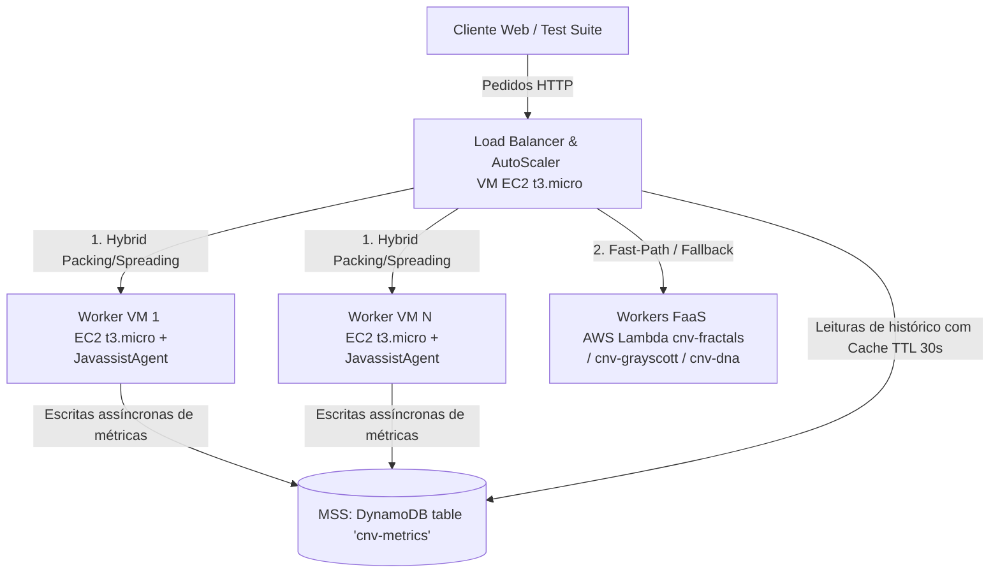

# Nature@Cloud — Análise Detalhada do Estado Atual do Projeto
**Fase de Entrega Final**
**UC:** Computação e Virtualização na Nuvem (CNV) - IST 2025-26
**Grupo 35:** Luís Rosa (ist1116307), Laura Rodrigues (ist1116260), João Guerreiro (ist1116375)

---

## 1. Visão Geral e Arquitetura do Sistema

O **Nature@Cloud** é um sistema elástico e resiliente concebido para correr na infraestrutura da Amazon Web Services (AWS) e suportar a execução de cargas de trabalho computacionalmente intensivas inspiradas na Natureza. 

O sistema expõe três algoritmos (workloads) principais através de endpoints HTTP:
*   **Fractais (`/fractals`):** Geração de imagens do conjunto fractal de Julia-set com base nas dimensões da imagem (`w` e `h`) e número de iterações (`iterations`).
*   **Gray-Scott (`/grayscott`):** Simulação de reação-difusão de substâncias químicas numa grelha, baseada em `size`, `maxIterations`, taxas de feed (`f`) e kill (`k`), seed mode (`seedMode`) e condição de paragem por extinção (`stopOnExtinction`).
*   **DNA (`/dna`):** Alinhamento de sequências FASTA de ADN para identificação de correspondências, baseado nas sequências `seq1` e `seq2`, comprimento mínimo (`minLength`) e interrupção na primeira correspondência (`stopOnFirst`).

A infraestrutura é desenhada segundo uma arquitetura de quatro camadas:



### Componentes Principais:
1.  **Workers EC2:** Instâncias `t3.micro` que correm um servidor web multi-threaded em Java. Estão equipadas com o `JavassistAgent` para instrumentação dinâmica no carregamento de classes, recolhendo instruções de bytecode executadas (ICount) e bytes alocados em memória (RAM) por cada thread.
2.  **Workers Lambda (FaaS):** Funções serveless configuradas com 512 MB de RAM para atuar como via rápida (fast-path) e segurança contra falhas (fallback) para tarefas de média/baixa complexidade, otimizando o custo global da infraestrutura e contornando cold starts lentos de VMs.
3.  **Metrics Storage System (MSS):** Uma tabela do DynamoDB (`cnv-metrics`) que persiste as métricas estruturadas de execução dinâmica dos workloads concluídos nas VMs de modo a permitir que o Load Balancer estime a complexidade de futuros pedidos com base no histórico.
4.  **Load Balancer (LB) & Auto-Scaler (AS):** Ponto de entrada do sistema co-localizado numa VM dedicada. O LB calcula a estimativa de complexidade (métrica composta CPU+RAM) usando o histórico ou fallback heurístico e distribui a carga por intermédio de uma estratégia híbrida de *packing* (OpenStack Nova style) e *spreading* com tolerância a falhas. O AS ajusta autonomamente o número de VMs ativas (1 a 5 instâncias) com base no tempo de processamento pendente em segundos, incorporando mecanismos de *safe scale-down* com drenagem de pedidos e adoção automática de instâncias órfãs.

---

## 2. Instrumentação de Bytecode (Javassist Agent)

A medição de complexidade recorre a uma instrumentação dinâmica com Javassist injetada no arranque dos workers pelo parâmetro `-javaagent`.

### 2.1 Métrica Primária: Contagem de Instruções de Bytecode (ICount)
A contagem de blocos básicos inicial era estática (`bytecodeLength / 15` injetada via `insertBefore()`), o que invalidava a medição de computação no interior de loops longos (como iterações dos fractais). 
Para solucionar isto, foi implementada uma análise dinâmica do fluxo de controlo de métodos (`ControlFlow.basicBlocks()`). 
A instrumentação funciona em duas fases:
1.  **Análise de Fluxo (Phase 1):** Analisa a estrutura e o fluxo de controlo de cada método no seu bytecode original. Determina os limites físicos de cada bloco básico e conta exatamente quantas instruções de bytecode residem em cada um deles.
2.  **Injeção de Payloads (Phase 2):** Ordena os blocos por ordem decrescente de posição no bytecode (para preservar a validade dos offsets das instruções anteriores) e injeta em cada entrada de bloco a chamada:
    ```java
    MetricRegistry.incrementInstructions(N); // onde N = número de instruções reais no bloco
    ```
    Desta forma, o contador acumulado de instruções acompanha o número exato de instruções de bytecode executadas dinamicamente durante a vida da thread que serve o pedido. O overhead da instrumentação mantém-se baixo (5% a 15%), uma vez que a injeção ocorre ao nível de blocos básicos e não por instrução individual. O `JavassistAgent` reconstrói a tabela stack-map (`rebuildStackMapIf6`) no final para garantir que o verificador do Java 11/17 aceite a classe.

### 2.2 Métrica Secundária: Alocação de Memória RAM
Para além de ICount, o worker recolhe o consumo de RAM de forma dinâmica e contention-free através de:
```java
com.sun.management.ThreadMXBean.getThreadAllocatedBytes()
```
*   **Contenção Zero:** Esta chamada é um hook nativo da JVM, que expõe uma estatística mantida pela própria VM de forma individual por ID de thread, evitando locks ou sobrecarga computacional.
*   **Cálculo por Pedido:** O `MetricRegistry` captura os bytes alocados no arranque do processamento e subtrai-os ao valor atual aquando do fim do pedido, calculando o delta de bytes alocados na thread.
*   **Tratamento de Exceções:** Devolve `-1` caso a monitorização de memória não seja suportada pelo runtime local.

### 2.3 Tratamento de Métricas no MetricRegistry e Gravação no DynamoDB
Os dados de execução acumulam-se em threads isoladas por um `ThreadLocal<RequestMetrics>`. Isto elimina qualquer contenção de escrita entre threads concorrentes da pool. 
Quando o processamento termina:
1.  É gerada uma foto imutável `CompletedRequest`.
2.  A foto é inserida num buffer circular local em memória (`ConcurrentLinkedDeque`, cap=1000) e exposta para depuração local.
3.  O `MetricsStorageService` submete a escrita da métrica ao DynamoDB de forma **assíncrona** usando uma pool com um daemon thread dedicado (`executor.submit()`). Deste modo, o tempo de latência de resposta do pedido não é inflacionado pelo RTT do DynamoDB.
4.  O registo é composto pelas chaves e atributos:
    *   `requestType` (HASH Key): Tipo do pedido (`fractals`, `grayscott`, `dna`).
    *   `requestId` (RANGE Key): Timestamp em ms + UUID único de 8 caracteres para evitar colisões.
    *   `instructionCount` (N): Total de bytecode instructions do pedido.
    *   `allocatedBytes` (N): Bytes alocados da thread.
    *   `methodCallCount` (N): Chamadas de método registadas (backup de telemetria).
    *   `elapsedTimeMs` (N): Tempo real de CPU.
    *   `param_<nome>` (S): Parâmetros de input traduzidos em string (ex: `param_iterations`).

---

## 3. Estimativa de Complexidade (Complexity Estimator)

O LB estima a complexidade (custo composto) de cada pedido de forma a decidir a melhor estratégia de routing. O estimador opera numa lógica em 2 camadas:

### 3.1 Camada 1: Estimativa Baseada em Histórico (DynamoDB)
O LB efetua uma consulta inicial de dados históricos no DynamoDB com base no tipo de pedido.
*   **Fórmula da Estimativa de Custo Composto:**
    $$Cost = w_{\text{CPU}} \times ICount_{\text{est}} + w_{\text{RAM}} \times RAM_{\text{est}}$$
    Configurado por default com pesos $w_{\text{CPU}} = 1.0$ e $w_{\text{RAM}} = 1.0$ (configuráveis a quente por `-Dcnv.estwork.wcpu` e `-Dcnv.estwork.wram`).
*   **Algoritmo Ratio-Based (Regressão Linear Simples):**
    Para cada registo do histórico $h$:
    $$Ratio_{\text{CPU}}(h) = \frac{ICount(h)}{Feature(h)}, \quad Ratio_{\text{RAM}}(h) = \frac{RAM(h)}{Feature(h)}$$
    Onde $Feature$ é uma variável representativa da complexidade calculada a partir dos inputs.
    O estimador calcula as médias destes rácios e multiplica-as pelo valor de feature do novo pedido para obter $ICount_{\text{est}}$ e $RAM_{\text{est}}$ individuais.
*   **Cache TTL 30s:** Para evitar que o DynamoDB se torne o gargalo do LB (exaustão de Read Capacity Units), os resultados históricos de queries (`MAX_HISTORY_RECORDS = 50` por tipo de request) são armazenados em cache durante 30s.

### 3.2 Camada 2: Fallback Heurístico (DynamoDB Offline/Sem Histórico)
Quando a BD está inacessível ou o cache está vazio, o LB calcula a estimativa usando funções matemáticas calibradas empiricamente.

#### Extração de Features e Fórmulas de Fallback:
1.  **Fractals:**
    *   *Feature:* $w \times h \times \min(iterations, 500)$. 
    *   *Justificação da Saturação (500 iterations):* Descobriu-se empiricamente que o conjunto Julia com $c=(-0.7, 0.6)$ satura aos ~500 iterações. A partir daí, os pixéis que escapam já o fizeram; aumentar a iteração máxima adiciona trabalho impercetível na computação do núcleo do fractal.
    *   *Heurística CPU:* $w \times h \times \min(iterations, 500) \times Multiplier_{\text{piecewise}}$
        O multiplicador CPU é piecewise para abranger a otimização JIT e regimes do fractal: `10` para iterações $\le 100$, `5` para iterações $\le 300$, e `2` para iterações superiores.
    *   *Heurística RAM:* $w \times h \times 33$ (calibrado a ~32.5 B/px).
2.  **Gray-Scott:**
    *   *Feature:* $size^2 \times maxIterations$.
    *   *Heurística CPU:* $size^2 \times maxIterations \times 164$ (rácio medido de $164 \pm 0.3\%$ constante).
    *   *Heurística RAM:* $size^2 \times 64$ (calibrado a ~63.5 B/cell). A RAM depende exclusivamente da alocação de grids na memória e é independente de `maxIterations` ou `seedMode`.
3.  **DNA:**
    *   *Feature:* $\max(length(seq1), length(seq2))$.
    *   *Heurística CPU:* $\max(1000, maxSeq \times 125)$.
    *   *Heurística RAM:* $maxSeq \times 800$ (calibrado a ~780 B/char).

---

## 4. Balanceamento de Carga e Tolerância a Falhas

O `LoadBalancer` recebe todos os pedidos HTTP e gere o ciclo de vida de comunicação com a pool de workers.

### 4.1 Algoritmo Híbrido: Packing + Spreading Fallback
Para maximizar a eficiência de custo e throughput, o balanceador decide o worker de destino usando uma lógica inspirada nos escalonadores de hipervisores da nuvem (OpenStack Nova):

```
Para cada worker "w" elegível:
    Se projectedLoad (currentLoad + requestCost) <= DEFAULT_MAX_CAPACITY (5e10 instruções):
        Mandar para o worker com MAIOR carga atual (Packing)
    Caso contrário:
        Identificar o worker com MENOR carga atual como candidato a Spreading
Retornar worker mais carregado (se houver algum sob a capacidade) ou, caso contrário, o menos carregado (Spreading)
```

*   **Vantagem do Packing:** Concentrar os pedidos em execução em poucos workers saturados. Isto permite que workers que se encontram sem trabalho continuem a zeros, tornando-se candidatos elegíveis para terminação imediata no Auto-Scaler (evitando faturas de instâncias desnecessárias).
*   **Vantagem do Spreading Fallback:** Se o volume global ultrapassar o limite calibrado por worker, o LB distribui o excesso pelos workers menos sobrecarregados, forçando o aumento da média de carga pendente e sinalizando a necessidade urgente de scale-up pelo Auto-Scaler.

### 4.2 Integração com AWS Lambda (FaaS Routing)
O LB tira partido das funções AWS Lambda para duas finalidades: **fast-path (bypass)** e **fallback**:

```
                       estimatedCostSeconds <= 5.0s?
                                     │
                           ┌─────────┴─────────┐
                          NÃO                 SIM
                           │                   │
                     [EC2 Normal]      Todos os workers > 80%?
                                               │
                                     ┌─────────┴─────────┐
                                    NÃO                 SIM
                                     │                   │
                               [EC2 Normal]      [Lambda Fast-Path]
                                     │                   │
                              Se EC2 Falhar              │
                                     │                   │
                               ┌─────┴─────┐             │
                            Retries?     Nenhum          │
                               │           │             │
                          Tentar W_N   [Lambda Fallback] │
                                           │             │
                                           └──────┬──────┘
                                                  ▼
                                            Forward Client
```

1.  **Elegibilidade Lambda (`LAMBDA_MAX_SECONDS = 5.0s`):** Apenas pedidos cuja estimativa wall-clock seja inferior a 5 segundos são enviados para Lambda. Pedidos pesados correm exclusivamente em EC2 para evitar timeouts no FaaS e custos sobredimensionados de faturação por segundo de Lambda.
2.  **Fast-Path (Capacity Overflow):** Se o pedido for elegível e **todos** os workers EC2 estiverem com carga estimada $> 80\%$ da capacidade de packing, o pedido é imediatamente desviado para Lambda. Isto poupa o tempo de cold start de uma nova VM EC2 (~60s) e serve o pico curto de tráfego com latência mínima.
3.  **Fallback (Fault Tolerance):** Se o LB falhar a comunicar com as VMs da pool (ex: timeouts ou erros de ligação), e após esgotar o limite de retries, o pedido é enviado para o Lambda correspondente como último recurso para evitar devolver erro `502/500` ao utilizador.

### 4.3 Mecanismos de Resiliência
*   **Retries com Exclusão:** Em caso de exceção de rede na comunicação com uma VM, o LB tenta reencaminhar o pedido até 3 vezes, mantendo o histórico de workers falhados (`triedWorkers`) para os excluir de escolhas na mesma sequência de retries.
*   **Degradação Graciosa:** Se as credenciais falharem, o LB opera localmente em localhost. Se o DynamoDB falhar, o ComplexityEstimator transita automaticamente para fórmulas heurísticas locais de fallback.

---

## 5. Elasticidade e Auto-Scaling (Auto-Scaler)

O `AutoScaler` é co-localizado com o LB e executa um ciclo de verificação a cada 5 segundos.

### 5.1 Calibração de Thresholds Baseada em Wall-Clock
Em vez de usar valores de instruções arbitrários e opacos, os limiares do AutoScaler foram calibrados empiricamente na capacidade real de computação de uma instância `t3.micro`:
*   **Throughput Calibrado:** $2.0 \times 10^6$ instruções de bytecode instrumentado por milissegundo.
*   **Fórmula de Carga Média do Cluster:**
    $$AvgWorkSeconds = \frac{\sum_{w \in Workers} w.estimatedWork}{NumWorkers \times Throughput \times 1000}$$
*   **Threshold Scale-Up (`SCALE_UP_SECONDS = 2.5s`):** Se a fila média de processamento estimado por worker exceder 2.5 segundos, o AS inicia uma nova VM EC2. Este threshold previne que novos pedidos sintam latências visíveis de fila.
*   **Threshold Scale-Down (`SCALE_DOWN_SECONDS = 0.6s`):** Se a fila média cair abaixo de 0.6 segundos, significa que a capacidade instalada é excessiva (workers maioritariamente idle) e o cluster encolhe. A diferença de ~4x entre limiares (histerese) previne a oscilação (*flapping*) do cluster.
*   **Capacidade de Packing (`MAX_CAPACITY = 25.0s`):** Corresponde a $5.0 \times 10^{10}$ instruções, protegendo o worker de receber mais pedidos do que os que conseguiria processar num tempo tolerável.
*   **Limites do Cluster:** Configurado para manter entre 1 (`MIN_WORKERS`) e 5 (`MAX_WORKERS`) instâncias ativas.

### 5.2 Safe Scale-Down (Drenagem de Pedidos com Adiamento)
A terminação intempestiva de VMs causava a perda de pedidos em execução na instância escolhida para morrer. O algoritmo atual implementa drenagem ativa:
1.  **Escolha e Isolamento:** Identifica a VM gerada pelo AutoScaler com menor carga pendente e remove-a da pool ativa do LB (impedindo que novos pedidos lhe sejam entregues).
2.  **Polling de Drenagem:** Executa um loop de verificação da contagem de pedidos ativos (`activeRequests`) a cada 2s, por um máximo de 15 iterações (30 segundos no total).
3.  **Adiamento Protetor:** Se após os 30s a máquina ainda contiver pedidos em curso (ex: simulação pesada de Gray-Scott), a terminação da instância é **cancelada**. O worker é reintroduzido na pool ativa para que possa ser utilizado caso ocorra um pico, e a terminação é re-tentada no ciclo seguinte de scaling. Isto assegura perda zero de pedidos em curso.

### 5.3 Health Checks e Eliminação de Instâncias Órfãs
*   **Pings Periódicos:** O `WorkerPool` pinga os workers ativos a cada 15 segundos.
*   **Eviction:** Ao somar 3 falhas de ligação consecutivas, o worker é considerado danificado e removido da pool.
*   **Eliminação de Órfãos:** O AutoScaler regista-se como callback do evento de eviction (`setOnUnhealthyEviction`). Ao detetar a expulsão por saúde, efetua uma chamada imediata à AWS API (`terminateInstances`) para desligar a máquina. Isto evita o desperdício de faturação com instâncias cujo sistema operativo corre mas o web server Java crashou.
*   **Adoção Activa de Instâncias:** No arranque, o AutoScaler executa um inventário (`discoverExistingWorkers()`) pesquisando por instâncias running com as tags `Project=NatureAtCloud` e `Role=worker`. Adota-as imediatamente na pool do LB, sincronizando o estado e permitindo que instâncias criadas em execuções anteriores ou manualmente no dashboard AWS caiam sob controlo automático de escala.

---

## 6. Resultados Experimentais e Evidências Empíricas

A calibração do sistema é sustentada por dois conjuntos extensivos de dados experimentais registados na pasta `benchmarks/`.

### 6.1 Calibração de Memória RAM (`bench-ram-calibration.csv`)
Foram efetuadas 16 medições locais detalhadas cobrindo os três tipos de tarefas.

| Algoritmo | Parâmetros de Input | ICount (CPU) | RAM Delta (Medido) | RAM Estimada (Antiga) | RAM Estimada (Calibrada) |
|---|---|---|---|---|---|
| **Fractals** | 400×400, iter=100 | 122.2M | 5.40 MB | 1.28 MB | 5.28 MB |
| **Fractals** | 800×600, iter=100 | 366.9M | 15.91 MB | 3.84 MB | 15.84 MB |
| **Fractals** | 800×600, iter=500 | 422.3M | 15.43 MB | 19.20 MB | 15.84 MB |
| **Gray-Scott** | size=128, iter=2000 | 5.38 B | 1.05 MB | 0.32 MB | 1.04 MB |
| **Gray-Scott** | size=256, iter=5000 | 53.77 B | 4.05 MB | 1.31 MB | 4.19 MB |
| **DNA** | maxSeq=500 | 61.4 K | 414.0 KB | 100.0 KB | 400.0 KB |

#### Descobertas Chave da Calibração de RAM:
*   **Independência de Iterações:** A memória necessária para Fractals e Gray-Scott escala exclusivamente com as dimensões de armazenamento dos buffers da imagem (`w * h` ou $size^2$) e é **independente do número de iterações**. Isto prova que a RAM é uma feature ortogonal à CPU. Dois pedidos fractais de mesma resolução mas iterações diferentes consomem a mesma quantidade de memória, mas diferem amplamente em CPU.
*   **DNA como Workload RAM-Dominante:** O ratio ICount/AllocatedBytes para o DNA é de **0.15** (o DNA aloca ~6.7 bytes por cada instrução de bytecode de cálculo executada, devido a alocações constantes de strings e arrays de alinhamento). É o único workload onde a pressão de memória é o recurso dominante e o ICount é negligenciável.
*   **Correção de Subestimação:** As heurísticas antigas subestimavam a memória consumida em ~3-4x. A calibração reduziu o erro das estimativas para $< 10\%$ nas dimensões operacionais de produção.

### 6.2 Calibração de Throughput da Instância t3.micro (`bench-t3micro-throughput.csv`)
Foram efetuados testes com 8 pedidos estruturados de forma sequencial numa instância `t3.micro` real na AWS na região `eu-west-1`.

*   **Resultados por Request:**
    *   `fractals` 400×400, iter=100: $1.79 \times 10^6$ instr/ms (Tempo: 68 ms)
    *   `fractals` 800×600, iter=100: $1.94 \times 10^6$ instr/ms (Tempo: 189 ms)
    *   `fractals` 1600×1200, iter=100: $2.10 \times 10^6$ instr/ms (Tempo: 698 ms)
    *   `grayscott` size=64, iter=1000: $1.86 \times 10^6$ instr/ms (Tempo: 362 ms)
    *   `grayscott` size=128, iter=2000: $2.16 \times 10^6$ instr/ms (Tempo: 2490 ms)
    *   `grayscott` size=256, iter=5000: $2.12 \times 10^6$ instr/ms (Tempo: 25340 ms)
    *   `dna` maxSeq=500: $1.61 \times 10^6$ instr/ms (Tempo: 38 ms)
*   **Throughput Médio Calibrado:** **$1.96 \times 10^6 \approx 2.0 \times 10^6$ instr/ms** (Desvio Padrão: 9.5%).
*   **Efeito de JIT Warmup:** Cargas curtas (DNA, fractals pequenos) mostram throughput ~10% inferior devido ao custo inicial de interpretação e compilação JIT de classes da JVM. Para workloads pesados de Gray-Scott, a máquina estabiliza no máximo de performance (~$2.12 \times 10^6$ instr/ms).
*   **Credits baseline:** Nota de que se a instância esgotar os créditos de CPU de burst da AWS, o throughput degrada para 10% do nominal ($0.2 \times 10^6$ instr/ms). A política de auto-scaling reage preventivamente de modo a dividir a carga por mais instâncias antes do desgaste de créditos.
*   **Comparação Local vs Cloud:** O throughput nas máquinas de desenvolvimento locais situa-se entre $4.0 - 6.0 \times 10^6$ instr/ms, confirmando que a `t3.micro` sob virtualização AWS corre a cerca de ~40% do desempenho de uma máquina desktop típica de laboratório.

---

## 7. Scripts de Provisionamento e Infra-as-Code

O repositório inclui uma pipeline de scripts bash altamente estruturada e idempotente localizada na diretoria `scripts/` para gerir todo o ciclo de vida dos recursos AWS sem intervenção no browser.

### 7.1 Ficheiros de Setup e Cleanup:
1.  **`aws-config.sh`:** Define variáveis de ambiente comuns (Região: `eu-west-1`, Tipos de Instância: `t3.micro`, tags, nomes de tabela, etc.) de forma centralizada.
2.  **`01-setup-iam.sh`:** Configura as Roles e Perfis de Instância:
    *   `CNV-LoadBalancer-Role`: Concede permissões para interagir com EC2, DynamoDB, Lambda e CloudWatch Logs. Incorpora a permissão inline crítica `iam:PassRole` para que o LB possa lançar instâncias worker sob o perfil `CNV-Worker-Role`.
    *   `CNV-Worker-Role`: Concede permissões de escrita/leitura no DynamoDB e CloudWatch Logs.
    *   `CNV-Lambda-ExecutionRole`: Permite a execução de Lambdas com escrita nas tabelas.
3.  **`02-setup-network.sh`:** Cria o Key Pair (`cnv-keypair.pem`) e define Security Groups:
    *   `cnv-lb-sg`: Expõe a porta do LB (`8080`) ao público externo e a porta `22` (SSH) restrita ao IP externo do utilizador (/32).
    *   `cnv-worker-sg`: Expõe a porta do worker (`8000`) restrita exclusivamente ao tráfego vindo do `cnv-lb-sg` (protegendo os workers de acessos diretos externos).
4.  **`03-create-ami.sh` (AMI Bake):** 
    *   Cria uma VM EC2 temporária, instala o Java 11 (Amazon Corretto), copia os JARs compilados (`webserver` e `javassist-agent`), configura um serviço systemd (`cnv-worker.service`) para arranque automático em boot, valida o funcionamento, desliga e gera a AMI de produção `cnv-worker-ami-*`.
5.  **`04-launch-worker.sh`:** Lança um worker standalone a partir da AMI para testes rápidos de sanidade.
6.  **`05-launch-lb.sh`:** Lança a instância do Load Balancer sob a role e SG correspondentes, passando todas as system properties necessárias (SG do worker, ID da AMI, IP do DynamoDB) no arranque do servidor de balanceamento.
7.  **`06-deploy-lambdas.sh`:** Cria ou atualiza as 3 funções Lambda (`cnv-fractals`, `cnv-grayscott`, `cnv-dna`) enviando os ficheiros ZIP compilados em cada pasta correspondente com timeout de 30s e RAM de 512 MB.
8.  **`99-cleanup.sh`:**
    *   *Default:* Termina todas as instâncias EC2 ativas ligadas ao projeto Nature@Cloud para evitar custos.
    *   *Deep Mode (`--deep`):* Efetua a destruição integral da infraestrutura da conta (AMI, snapshots, Security Groups, Roles, Tabela DynamoDB, Funções Lambda e Key Pairs), devolvendo o estado limpo à conta AWS.

---

## 8. Avaliação do Estado do Projeto e Validação

De acordo com o plano de validação detalhado no ficheiro `PROJECT_STATUS.md`, o projeto encontra-se num estado **100% Funcional e Concluído**.

### 8.1 Níveis de Teste Concluídos:
*   **Nível 0 (Sanidade Local):** Compilação bem-sucedida de todos os módulos. Geração dos JARs do webserver, agente Javassist e loadbalancer.
*   **Nível 1 (Worker Local + Métrica Composta):** Confirmação local de que o agente Javassist injeta o ICount CFG e recolhe a RAM do ThreadMXBean sem erros, reportando valores coerentes.
*   **Nível 2 (LB Local + ComplexityEstimator):** Validação local da estimativa baseada em fórmulas e caching in-memory.
*   **Nível 3 (Credenciais AWS):** Ligação e autorização AWS verificadas através do CLI em WSL/Linux.
*   **Nível 4 (Pipeline de Scripts AWS):** Provisionamento de IAM, Network, AMI e instâncias verificado sequencialmente com conversão LF (WSL-friendly).
*   **Nível 5 (End-to-End AWS):** Execução remota das 3 cargas de trabalho via IP público do LB com persistência assíncrona bem-sucedida das métricas na tabela DynamoDB.
*   **Nível 6 (Integração Lambda):** Deploy idempotente das 3 Lambdas. Invocação direta e encaminhamento de pedidos pequenos pelo LB (fast-path e fallback) testados em produção.
*   **Nível 7 (AutoScaler Scale-Up/Down):** Injeção de carga pesada desencadeou scale-up e provisionamento de novo worker via API AWS. Estabilização da carga resultou na drenagem completa de pedidos e terminação correta da instância sem perturbações de serviço.

---

## 9. Recomendações para a Redação do Relatório Final

Para obter a nota máxima na redação do relatório final (limite de 6 páginas), o grupo deve estruturar o texto em torno das seguintes justificações técnicas fundamentadas pelas evidências empíricas recolhidas:

1.  **Defesa da Métrica Composta Dominada por CPU:**
    *   O ICount e a RAM são genuinamente ortogonais, o que é provado pelo facto de a RAM não se alterar com iterações no Fractals/Gray-Scott, ao contrário do ICount.
    *   A dominância de ICount nas cargas atuais deve-se à natureza dos algoritmos (CPU-bound). O DNA comprova a flexibilidade do modelo, pois mostra que um algoritmo orientado a strings inverte esta relação (ratio $0.15$ ICount/RAM). O modelo composto está assim preparado para qualquer workload futuro através do ajuste de $w_{\text{CPU}}$ e $w_{\text{RAM}}$.
2.  **Otimização do Custos com a Estratégia de Routing Híbrido:**
    *   Em vez de spreading puro (Least-Loaded), que distribui a carga por todos os workers e os mantém ativos (impedindo a redução de instâncias), o Packing consolida os pedidos no menor número de servidores possível. Isto cria oportunidades de desligamento e poupa na fatura de horas EC2.
    *   O Spreading Fallback atua como rede de segurança quando o cluster está totalmente saturado.
3.  **Bypass para Lambda como Decisão Racional:**
    *   O tempo de arranque de uma `t3.micro` é de ~60 segundos. Encaminhar um pico pontual de pedidos rápidos ($\le 5.0$s) para Lambda evita cold starts dolorosos em VMs e custos associados com instâncias que ficariam ativas durante a hora mínima de faturação.
    *   O Lambda atua apenas como válvula de escape (fast-path) ou em falhas (fallback), preservando o uso das VMs (mais baratas por pedido contínuo) para o fluxo comum.
4.  **Redução de Erros por Correções em Drenagem de Escala (Safe Scale-Down):**
    *   Explicar detalhadamente o mecanismo de drenagem e adiamento. Demonstrar a robustez do sistema que prefere reintroduzir a máquina na pool do que forçar a terminação e quebrar o processamento de simulações pesadas já aceites.
5.  **Automação e Reprodutibilidade:**
    *   Salientar a pipeline de scripts que cria toda a infraestrutura AWS a partir do zero e a apaga totalmente no fim, mostrando controlo sobre custos na nuvem e facilidade de deploy contínuo.
